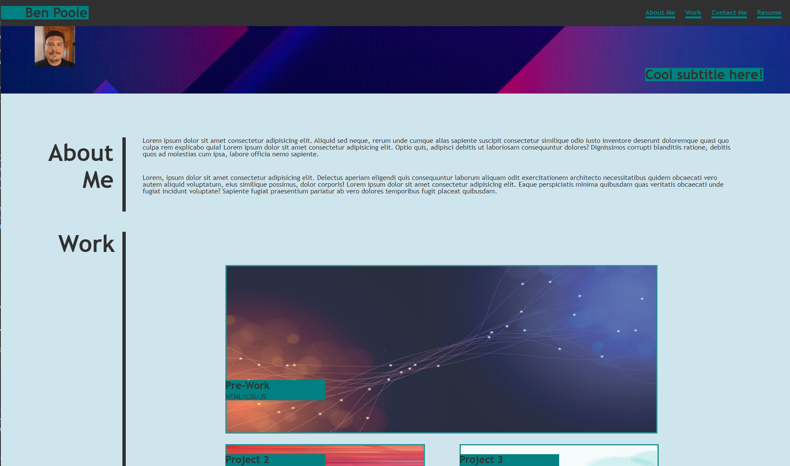

# Ben Poole's Portfolio

## Description

This is a portfolio I was asked to create with the knowledge I've gained over the last couple of weeks.  Please forgive me as I really only had 1 project to link to so I made that my main project link while the rest link to my github account.  I left some of the filler language as I wasn't sure how important it was that I put some kind of unique wording in.  The content adapts to the size of the screen.  Enjoy!

https://bpoole53.github.io/ben-poole-portfolio-project/

## Installation

N/A

## Usage

To see semantic tags and commenting in action and how it can help make html and CSS more accessible.

## Credits

N/A

## License

N/A

